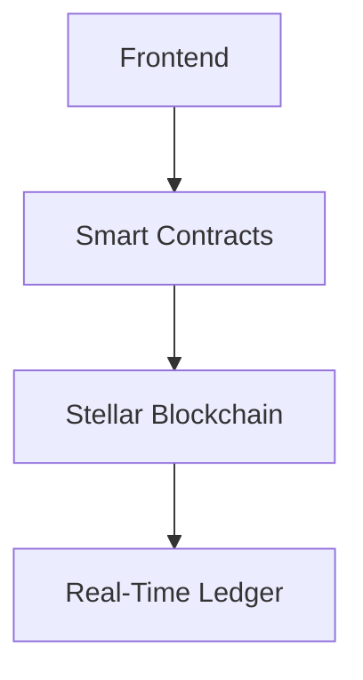

# 🏢 FairWage - Blockchain Payroll System

[](https://opensource.org/licenses/MIT)
[](https://replit.com)
[](https://soroban.stellar.org/)

A decentralized payroll system built on Stellar Soroban enabling real-time wage accrual and instant withdrawals.

## 🚀 **Current Status**
- 🔧 **Development Ready**: Configured for local development and Replit environment
- ✅ **Frontend**: Next.js 13 with TypeScript and Tailwind CSS
- ✅ **Backend**: Node.js Express server with Stellar SDK integration
- ✅ **Smart Contracts**: Fungible token contract (Rust/Soroban)
- 📋 **In Progress**: Full FairWage payroll contract development
- 🧪 **Testing**: Basic contract functionality tested on Stellar testnet

## 📋 Table of Contents
- [Features](#-features)
- [Architecture](#-architecture)
- [Quick Start](#-quick-start)
- [Development](#-development) 
- [Testing](#-testing)
- [Deployment](#-deployment)
- [Security](#-security)
- [Contributing](#-contributing)
- [License](#-license)

## ✨ Features

### 🏭 Employer Dashboard
| Feature | Description |
|---------|-------------|
| 📦 Multi-Company Management | Manage multiple companies with isolated contracts |
| 💸 Real-Time Fund Tracking | Live balance monitoring per company |
| 🛠️ Contract Deployment | Deploy token & payroll contracts in 1-click |
| 👥 Employee Management | Add/remove employees with granular permissions |
| 💰 Fund Deposits | Secure deposits with audit trail |

### 👷 Employee Dashboard
| Feature | Description |
|---------|-------------|
| ⏱️ Real-Time Accrual | Per-second wage calculation |
| 💳 Instant Withdrawals | Withdraw anytime with 3-sec finality |
| 📊 Performance Analytics | Work hours & productivity tracking |
| 🔒 Secure Wallet | Freighter wallet integration |

### 🔗 Blockchain Core


## 🚀 Quick Start

### 🔧 **Replit Environment**
The project is configured to run on Replit:

1. **Frontend**: Next.js development server on port 5000
2. **Backend**: Express API server on port 3001  
3. **Smart Contracts**: Fungible token contract ready for deployment
4. **Wallet**: Freighter wallet integration for Stellar testnet

### 🏆 **For Hackathon Participants**
This project is designed to be easily deployable and testable for hackathon submissions.

### 💻 **Local Development Setup**

1. **Clone the repository**
```bash
git clone https://github.com/antidumpalways/FairWage.git
cd FairWage
```

2. **Install Frontend Dependencies**
```bash
cd Frontend
npm install
```

3. **Install Backend Dependencies**
```bash
cd ../Backend
npm install
```

4. **Build Smart Contracts** (Optional)
```bash
cargo build --target wasm32-unknown-unknown --release
```

5. **Start Development**
```bash
# Frontend (port 5000)
cd Frontend && npm run dev

# Backend (port 3001)
cd Backend && npm start
```

6. **Access the Application**
```
Frontend: http://localhost:5000
Backend API: http://localhost:3001/health
```

### **Quick Test Backend Features**

```bash
# 1. Setup test environment
cd Backend
soroban keys generate --global test-key
ADDRESS=$(soroban keys address test-key)
curl "https://friendbot.stellar.org/?addr=$ADDRESS"

# 2. Build contracts
cargo build --target wasm32-unknown-unknown --release

# 3. Deploy FairWage Contract
WASM_HASH=$(soroban contract install --source-account test-key --wasm target/wasm32-unknown-unknown/release/fair_wage_contract.optimized.wasm --network testnet)
CONTRACT_ID=$(soroban contract deploy --source-account test-key --wasm-hash $WASM_HASH --network testnet)

# 4. Initialize FairWage Contract
soroban contract invoke --id $CONTRACT_ID --source-account test-key --network testnet -- initialize --token_address $ADDRESS --employer $ADDRESS

# 5. Add Employee
soroban contract invoke --id $CONTRACT_ID --source-account test-key --network testnet -- add_employee --employee-address $ADDRESS --wage-rate 1000000

echo "✅ Backend ready! Contract ID: $CONTRACT_ID"
```

## 🏗️ Architecture

### **Frontend (Next.js 13)**
- **Framework**: Next.js with TypeScript
- **Styling**: Tailwind CSS with shadcn/ui components
- **State Management**: React Context for wallet management
- **Blockchain SDK**: Sorobuild Stellar SDK integration

### **Backend (Rust + Soroban)** 🦀
- **Smart Contracts**: Rust-based Soroban contracts
- **Token System**: Custom SCF-020 compliant tokens
- **Wage Logic**: Real-time per-second accrual
- **Security**: Role-based access control & signed auth

#### Development Setup
```shell
# 1. Install dependencies
winget install Rustlang.Rustup
rustup update
rustup target add wasm32-unknown-unknown
cargo install --locked soroban-cli

# 2. Build contracts
cd Backend
cargo build --target wasm32-unknown-unknown --release

# 3. Optimize WASM
soroban contract optimize --wasm target/wasm32-unknown-unknown/release/fungible.wasm

# 4. Run tests
cargo test -- --nocapture

# 5. Setup test environment
soroban keys generate --global test-key
soroban keys show test-key
curl "https://friendbot.stellar.org/?addr=YOUR_ADDRESS"
```

#### Deployment Commands
```shell
# 1. Install contract
soroban contract install \
  --source-account test-key \
  --wasm target/wasm32-unknown-unknown/release/fungible.wasm \
  --network testnet

# 2. Deploy to Testnet
soroban contract deploy \
  --source-account test-key \
  --wasm-hash $WASM_HASH \
  --network testnet

# 3. Initialize Token
soroban contract invoke \
  --id $TOKEN_CONTRACT_ID \
  --source-account test-key \
  --network testnet \
  -- \
  initialize \
  --admin $EMPLOYER_ADDRESS \
  --decimal 6 \
  --name "Company Token" \
  --symbol "COMP"

# 4. Initialize FairWage Contract
soroban contract invoke \
  --id $FAIRWAGE_CONTRACT_ID \
  --source-account test-key \
  --network testnet \
  -- \
  initialize \
  --employer $EMPLOYER_ADDRESS \
  --token $TOKEN_CONTRACT_ID

# 5. Add Employee
soroban contract invoke \
  --id $FAIRWAGE_CONTRACT_ID \
  --source-account test-key \
  --network testnet \
  -- \
  add_employee \
  --employee $EMPLOYEE_ADDRESS \
  --wage_rate 1000000
```

### **Blockchain (Stellar Soroban)**
- **Network**: Stellar Testnet/Mainnet
- **Consensus**: Stellar Consensus Protocol
- **Transactions**: Fast 3-5 second finality
- **Fees**: Ultra-low transaction costs

## 📱 Usage

### **For Employers**

1. **Connect Wallet**
   - Install Freighter wallet extension
   - Connect to Stellar network
   - Ensure sufficient XLM balance

2. **Deploy Contracts**
   - Create company profile
   - Deploy custom token contract
   - Deploy FairWage smart contract
   - Add employees with wage rates

3. **Manage Payroll**
   - Deposit funds to contracts
   - Monitor employee balances
   - View transaction history

### **For Employees**

1. **Connect Wallet**
   - Install Freighter wallet extension
   - Connect to Stellar network
   - View real-time wage balance

2. **Monitor Earnings**
   - Real-time wage accrual display
   - Work statistics and performance
   - Transaction history tracking

3. **Withdraw Wages**
   - Instant withdrawals anytime
   - No waiting periods
   - Minimal gas fees

## 🔧 Development

### Project Structure
```
FairWage/
├── Backend/
│   ├── contracts/     # Smart contracts (Rust/Soroban)
│   ├── target/        # Compiled WASM files
│   ├── server.js      # Express API server
│   ├── package.json   # Node.js dependencies
│   └── Cargo.toml     # Rust dependencies
├── Frontend/
│   ├── app/           # Next.js 13 app router
│   ├── components/    # React UI components
│   ├── lib/           # Blockchain utilities
│   ├── .env.production # Production environment
│   └── package.json   # Frontend dependencies
├── LICENSE            # MIT License
├── package.json       # Root package config
├── README.md          # This file
└── replit.md          # Project documentation
```

### Core Contract Functions
```rust
// FairWage contract (lib.rs)
impl FairWage {
    /// Initialize contract with employer and token
    pub fn initialize(env: Env, employer: Address, token: Address) -> Result<(), Error> {
        // Implementation details...
    }
    
    /// Add new employee with per-second wage rate
    pub fn add_employee(env: Env, employee: Address, wage_rate: i128) -> Result<(), Error> {
        // Implementation details...
    }
}
```

#### **Current Smart Contracts**

**Fungible Token Contract** (Available)
- Standard Stellar Asset Contract (SAC) compatible
- Token initialization with admin, decimal, name, symbol
- Standard transfer, approve, balance functions
- Located in `Backend/contracts/fungible/`

**FairWage Payroll Contract** (In Development)
- Real-time wage accrual system
- Employee management functions
- Withdrawal and deposit mechanisms
- *Note: Full implementation in progress*

### **Environment Variables**

Create `.env.local` in Frontend directory:

```env
# Network Configuration
NEXT_PUBLIC_RPC_URL=https://soroban-testnet.stellar.org
NEXT_PUBLIC_NETWORK_PASSPHRASE=Test SDF Network ; September 2015

# Contract IDs (replace with your deployed contract ID)
NEXT_PUBLIC_FAIRWAGE_CONTRACT_ID=YOUR_CONTRACT_ID_HERE
NEXT_PUBLIC_TOKEN_WASM_HASH=YOUR_TOKEN_WASM_HASH_HERE
NEXT_PUBLIC_FAIRWAGE_WASM_HASH=YOUR_FAIRWAGE_WASM_HASH_HERE
```

**Note**: Replace the placeholder values with your actual deployed contract IDs from the deployment process above.

## 🧪 Testing

### **Frontend Testing**
```bash
cd Frontend
npm run test
npm run lint
```

### **Smart Contract Testing**
```bash
cd Backend
cargo test
```

### **Feature Testing - End to End**

#### **1. Setup Environment**
```bash
# Install dependencies
cd Backend
cargo build --target wasm32-unknown-unknown --release

# Generate test keypair
soroban keys generate --global test-key

# Get address
ADDRESS=$(soroban keys address test-key)
echo "Your address: $ADDRESS"

# Fund account with test XLM
curl "https://friendbot.stellar.org/?addr=$ADDRESS"
```

#### **2. Deploy FairWage Contract**
```bash
# Install FairWage contract
WASM_HASH=$(soroban contract install \
  --source-account test-key \
  --wasm target/wasm32-unknown-unknown/release/fair_wage_contract.optimized.wasm \
  --network testnet)

# Deploy FairWage contract
CONTRACT_ID=$(soroban contract deploy \
  --source-account test-key \
  --wasm-hash $WASM_HASH \
  --network testnet)

# Initialize FairWage
soroban contract invoke \
  --id $CONTRACT_ID \
  --source-account test-key \
  --network testnet \
  -- \
  initialize \
  --token_address $ADDRESS \
  --employer $ADDRESS

echo "✅ Contract deployed! ID: $CONTRACT_ID"
```

#### **3. Test Employee Management**
```bash
# Add employee (using same address for testing)
soroban contract invoke \
  --id $CONTRACT_ID \
  --source-account test-key \
  --network testnet \
  -- \
  add_employee \
  --employee-address $ADDRESS \
  --wage-rate 1000000

# Update wage rate
soroban contract invoke \
  --id $CONTRACT_ID \
  --source-account test-key \
  --network testnet \
  -- \
  update_wage_rate \
  --employee $ADDRESS \
  --new_wage_rate 2000000

# Remove employee
soroban contract invoke \
  --id $CONTRACT_ID \
  --source-account test-key \
  --network testnet \
  -- \
  remove_employee \
  --employee $ADDRESS
```

#### **4. Test Fund Management**
```bash
# Deposit funds to FairWage (Note: requires valid token contract)
soroban contract invoke \
  --id $CONTRACT_ID \
  --source-account test-key \
  --network testnet \
  -- \
  deposit \
  --amount 500000000

# Withdraw surplus (employer)
soroban contract invoke \
  --id $CONTRACT_ID \
  --source-account test-key \
  --network testnet \
  -- \
  withdraw_surplus \
  --amount 100000000
```

#### **5. Test Employee Withdrawals**
```bash
# Check accrued balance
soroban contract invoke \
  --id $CONTRACT_ID \
  --source-account test-key \
  --network testnet \
  --send=yes \
  -- \
  get_accrued_balance \
  --employee-address $ADDRESS

# Employee withdraw wages
soroban contract invoke \
  --id $CONTRACT_ID \
  --source-account test-key \
  --network testnet \
  -- \
  withdraw \
  --employee $ADDRESS \
  --amount 1000000
```

### **Quick Test Script**
```bash
#!/bin/bash
echo "🚀 Starting FairWage Feature Testing..."

# 1. Setup
echo "📋 Step 1: Setting up environment..."
soroban keys generate --global test-key
ADDRESS=$(soroban keys address test-key)
echo "Your address: $ADDRESS"
curl "https://friendbot.stellar.org/?addr=$ADDRESS"

# 2. Build
echo "📋 Step 2: Building contracts..."
cargo build --target wasm32-unknown-unknown --release

# 3. Deploy
echo "📋 Step 3: Deploying contracts..."
WASM_HASH=$(soroban contract install --source-account test-key --wasm target/wasm32-unknown-unknown/release/fair_wage_contract.optimized.wasm --network testnet)
CONTRACT_ID=$(soroban contract deploy --source-account test-key --wasm-hash $WASM_HASH --network testnet)

# 4. Initialize
echo "📋 Step 4: Initializing contracts..."
soroban contract invoke --id $CONTRACT_ID --source-account test-key --network testnet -- initialize --token_address $ADDRESS --employer $ADDRESS

# 5. Add Employee
echo "📋 Step 5: Adding employee..."
soroban contract invoke --id $CONTRACT_ID --source-account test-key --network testnet -- add_employee --employee-address $ADDRESS --wage-rate 1000000

echo "✅ Feature testing completed!"
echo "FairWage Contract ID: $CONTRACT_ID"
echo "Employer Address: $ADDRESS"
echo "Save these values for frontend configuration!"
```

### **Manual Testing Checklist**
- [ ] Deploy contracts to testnet
- [ ] Test employer workflow (add employee, deposit funds)
- [ ] Test employee workflow (check balance, withdraw wages)
- [ ] Test wage rate updates
- [ ] Test employee removal
- [ ] Verify blockchain transactions
- [ ] Test error handling

### **Troubleshooting**

#### **Common Issues & Solutions**

**Issue: "source-account required"**
```bash
# Generate keypair first
soroban keys generate --global test-key
soroban keys address test-key
```

**Issue: "Insufficient balance"**
```bash
# Fund account with test XLM
curl "https://friendbot.stellar.org/?addr=YOUR_ADDRESS"
```

**Issue: "target wasm32-unknown-unknown not found"**
```bash
# Install target
rustup target add wasm32-unknown-unknown
```

**Issue: "soroban command not found"**
```bash
# Install Soroban CLI
curl -sSfL https://soroban.stellar.org/install.sh | sh
# Restart terminal
```

**Issue: "Build failed"**
```bash
# Clean and rebuild
cargo clean
cargo build --target wasm32-unknown-unknown --release
```

**Issue: "WASM file not found"**
```bash
# Use the correct WASM file name
ls target/wasm32-unknown-unknown/release/
# Use: fair_wage_contract.optimized.wasm
```

**Issue: "InvalidAction error"**
```bash
# Use optimized WASM file
soroban contract install --wasm target/wasm32-unknown-unknown/release/fair_wage_contract.optimized.wasm
```

#### **Test Commands Reference**
```bash
# Quick test all features
cd Backend
cargo test -- --nocapture

# Test specific feature
cargo test test_fair_wage_full_scenario -- --nocapture

# Deploy and test
soroban keys generate --global test-key
ADDRESS=$(soroban keys address test-key)
curl "https://friendbot.stellar.org/?addr=$ADDRESS"
cargo build --target wasm32-unknown-unknown --release
```

## 🚀 Deployment

### 🌐 **Replit Deployment**
The project can be deployed on Replit using the configured workflows:

```bash
# Current Workflows
Frontend: npm run dev (port 5000)
Backend: npm start (port 3001)
Environment: Development/Testing
```

### 🏗️ **Smart Contract Deployment**

Deploy the fungible token contract to Stellar testnet:
```bash
# Build the contract
cd Backend
cargo build --target wasm32-unknown-unknown --release

# Deploy to testnet (requires Soroban CLI and funded account)
soroban contract install \
  --source-account test-key \
  --wasm target/wasm32-unknown-unknown/release/fungible.wasm \
  --network testnet
```

### 📋 **Environment Variables**
Create `.env.local` files for local development:

**Frontend/.env.local:**
```env
NEXT_PUBLIC_RPC_URL=https://soroban-testnet.stellar.org
NEXT_PUBLIC_NETWORK_PASSPHRASE=Test SDF Network ; September 2015
NEXT_PUBLIC_HORIZON_URL=https://horizon-testnet.stellar.org
# For local development:
NEXT_PUBLIC_API_URL=http://localhost:3001
# For deployment, use relative paths or environment-specific URLs
```

**Backend/.env:**
```env
PORT=3001
NODE_ENV=development
RPC_URL=https://soroban-testnet.stellar.org
NETWORK_PASSPHRASE=Test SDF Network ; September 2015
```

## 🔒 Security Features

- **Role-Based Access Control** - Only employers can manage employees
- **Input Validation** - Comprehensive parameter validation
- **Secure Withdrawals** - Employees can only withdraw their own wages
- **Audit Trail** - Complete transaction history on blockchain
- **No Central Authority** - Fully decentralized system

## 📊 Performance

- **Real-Time Updates** - Balance updates every 10 seconds
- **Fast Transactions** - 3-5 second finality on Stellar
- **Low Fees** - Minimal transaction costs
- **Scalable** - Handles multiple companies and employees

## 🤝 Contributing

1. Fork the repository
2. Create a feature branch (`git checkout -b feature/amazing-feature`)
3. Commit your changes (`git commit -m 'Add amazing feature'`)
4. Push to the branch (`git push origin feature/amazing-feature`)
5. Open a Pull Request

### **Development Guidelines**
- Follow TypeScript best practices
- Use conventional commit messages
- Add tests for new features
- Update documentation as needed

## 📄 License

This project is licensed under the MIT License - see the [LICENSE](LICENSE) file for details.

## 🙏 Acknowledgments

- **Stellar Development Foundation** - For the amazing Soroban platform
- **Sorobuild Team** - For the excellent SDK and tools
- **OpenZeppelin** - For smart contract best practices
- **shadcn/ui** - For the beautiful UI components

## 📞 Support & Links

- **Live Demo**: Available on Replit (Frontend port 5000)
- **API Health**: `GET /health` endpoint on port 3001
- **Stellar Network**: Testnet deployment with real contract interactions
- **Wallet Integration**: Freighter wallet required for testing

## 🔮 Roadmap

### **Phase 1 (Current)**
- ✅ Basic employer/employee functionality
- ✅ Real-time wage accrual
- ✅ Instant withdrawals
- ✅ Multi-company support

### **Phase 2 (Next)**
- 🔄 Advanced analytics dashboard
- 🔄 Automated payroll scheduling
- 🔄 Tax calculation integration
- 🔄 Mobile app development

### **Phase 3 (Future)**
- 📋 Cross-chain compatibility
- 📋 DeFi integration
- 📋 AI-powered insights
- 📋 Enterprise features

---

**Built with ❤️ on Stellar Soroban**

*Empowering the future of decentralized payroll*
